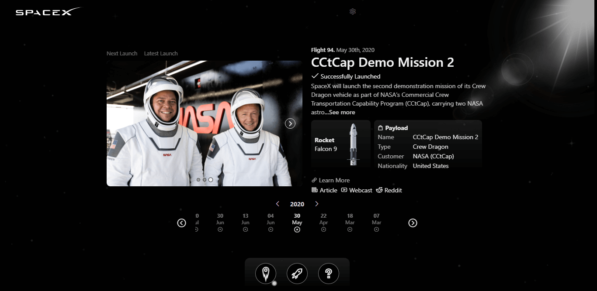

<p align="center"></p>

<h1 align="center">SpaceX Launches</h1>

<h3 align="center">
SpaceX Launches is an app that allows users to keep track of current, upcoming, and previous SpaceX launches, rockets, and corporate information.
</h3>


<br>
<h3 align="center">

Made with <br>


</h3>
<br>

<h3>
<strong>Links</strong>

<a href="https://spacex-launchesx.netlify.app" target="_blank">View the app in action.</a>

<a href="https://github.com/r-spacex/SpaceX-API/" target="_blank">API Data Provider</a>

<a href="https://www.behance.net/gallery/149607917/SpaceX-Launches" target="_blank">Check out more screenshots on behance.</a>
</h3>
<br>

## Project setup
```
npm install
```

### Compiles and hot-reloads for development
```
npm run serve
```

### Compiles and minifies for production
```
npm run build
```

### Customize configuration
See [Configuration Reference](https://cli.vuejs.org/config/).